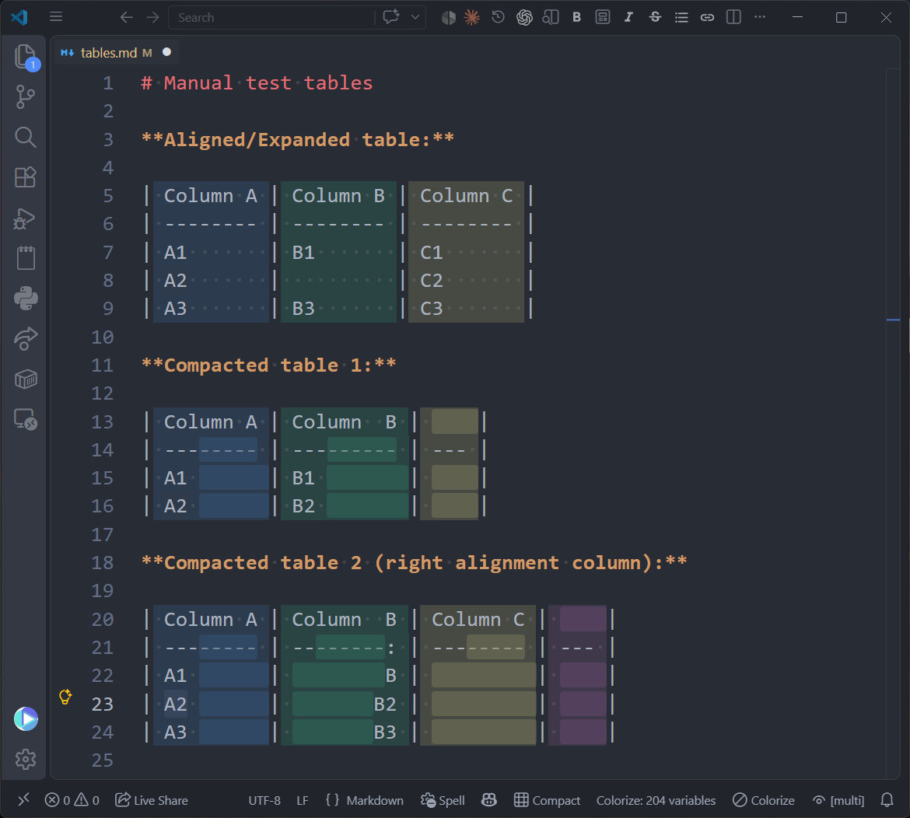
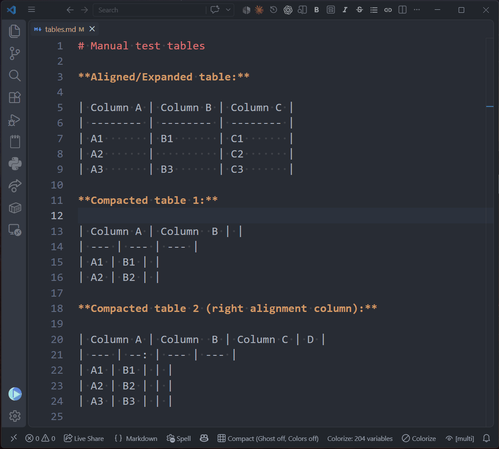

# Markdown Ghost Tables

Keep your markdown tables **compact in the file** while they **look perfectly aligned on screen**.

Alignment padding in markdown tables is presentation, not content: it bloats files, makes diffs rewrite whole rows when one cell grows, and costs tokens for AI agents that read your repos. This extension decouples bytes from pixels.



## Features

- **Ghost alignment** — virtual padding rendered with VS Code decorations: compact tables look column-aligned without a single real space written to the file. The ghost padding has a subtle background tint so you always know which spaces are real. Adaptive by design: on a table that is already aligned with real spaces it renders nothing, so it never double-aligns.
- **Column colors** — each column gets a subtle rainbow-style background for readability.
- **Compact / Expand commands** — normalize all tables in the document either way, preserving alignment colons (`:---`, `---:`, `:---:`), escaped pipes (`\|`) and tables inside code fences (untouched).
- **Format on save** — declare the mode (`compact` or `expand`) per user or per repo (`.vscode/settings.json`), enable format-on-save, and every save normalizes the tables.
- **Status bar menu** — a `$(table)`-style status bar item (visible on markdown files, showing the current mode) opens a checklist to toggle every feature in place: ghost alignment, column colors, expand mode, Tab navigation and format-on-save. Handy for isolating what you see while debugging a table.
- **Tab navigation (optional, off by default)** — Tab/Shift+Tab inside a table formats it to the mode and jumps between cells, adding a new row at the end. Designed to coexist with the Markdown Table extension — see [Markdown Table friendly](#markdown-table-friendly).

## See it in action



Tab navigation first expands the table and then compacts it again, cell by cell; then ghost alignment comes on — compact bytes, aligned pixels — and finally the column colors.

## Markdown Table friendly

This extension is built to coexist with [Markdown Table](https://marketplace.visualstudio.com/items?itemName=TakumiI.markdowntable) (`takumii.markdowntable`), and we recommend running both: they do different jobs. Markdown Table is the full table *editor* — it aligns with real spaces and brings row and column operations, sorting and more. Markdown Ghost Tables governs how tables **rest in the file** (compact) and how they **look on screen** (ghost alignment, column colors). Nothing here fights it: this extension writes no padding of its own unless you ask for `expand`, and it detects Markdown Table to hand it the Tab wherever that is the better tool.

The Tab splits by mode: in `expand` mode Markdown Table's Tab wins (real-space alignment is its job); in `compact` mode this extension takes it. **With both installed**, one extra step is needed — VS Code runs the last-loaded extension when two bind the same key, and that is Markdown Table. Add these two rules to your user `keybindings.json`: user rules beat extensions, and the `tabOurs` clause makes them fire only when the Tab is ours, so Markdown Table's Tab stays untouched in `expand` mode. The extension offers to copy them when it detects the conflict.

```json
{
    "key": "tab",
    "command": "markdownGhostTables.nextCell",
    "when": "markdownGhostTables.tabOurs && markdownGhostTables.inTable && editorTextFocus && !editorReadonly && editorLangId == 'markdown' && !suggestWidgetVisible && !editorTabMovesFocus && !inlineSuggestionVisible && !editorHasMultipleSelections"
},
{
    "key": "shift+tab",
    "command": "markdownGhostTables.prevCell",
    "when": "markdownGhostTables.tabOurs && markdownGhostTables.inTable && editorTextFocus && !editorReadonly && editorLangId == 'markdown' && !suggestWidgetVisible && !editorTabMovesFocus && !inlineSuggestionVisible && !editorHasMultipleSelections"
}
```

## Settings

| Setting | Default | What it does |
| --- | --- | --- |
| `markdownGhostTables.mode` | `compact` | Table mode (`compact` / `expand`): drives format-on-save and Tab formatting |
| `markdownGhostTables.ghostAlign` | `true` | Virtual column alignment |
| `markdownGhostTables.columnColors` | `true` | Continuous rainbow bands per column (separator included) |
| `markdownGhostTables.ghostShade` | `2` | With colors on: live multiplier over the column's alpha for the ghost background — at the uniform point the ghost blends into the band, above it it reads as a pastille |
| `markdownGhostTables.bandShade` | `2` | With colors on: live multiplier over each column's alpha for the band background |
| `markdownGhostTables.pipeTint` | `false` | With colors on: tint every `\|` so the columns read as continuous bands with both edges closed (off: every pipe reads bare) |
| `markdownGhostTables.ghostTint` | `rgba(128,128,128,0.10)` | Background tint of the ghost padding when column colors are off |
| `markdownGhostTables.formatOnSave` | `false` | Normalize all tables to the mode on save |
| `markdownGhostTables.tabNavigation` | `false` | Tab formats to the mode + jumps between cells |

## Known limitations

- Column widths are measured in code points: emoji and CJK double-width characters are approximated.
- Center alignment pads to the right (like left alignment) in this version.

## Development

```sh
npm install
npm run build     # bundles src/ into dist/extension.js
npm run package   # produces the .vsix
```

The formatting algorithm lives in [src/core.mjs](src/core.mjs), dependency-free and VS Code-free; the extension ([src/extension.mjs](src/extension.mjs)) only maps its table model to editor decorations.

## License

[MIT](LICENSE.md)

## Credits

The icon for this extension is based on the Flaticon library: [Table icons created by Magnific - Flaticon](https://www.flaticon.com/free-icons/table)
